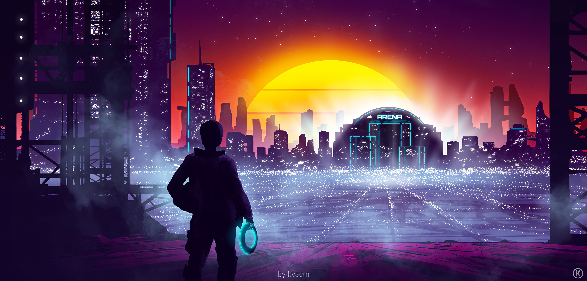

<h1 align="center">Hi, my name is Mathieu !</h1>

<h3 align="center">I'm a future full stack developper, currently into my second year of scholarship in Paris 🇫🇷.</h3>

<h3 align="center">You can take a look at my portfolio to know more about me and what I do outside IT !</h3>

<h1></h1>

<h3>Programing languages:</h3>

  
  
  
  
  
  
  

<h3>Frameworks</h3>

  
  

